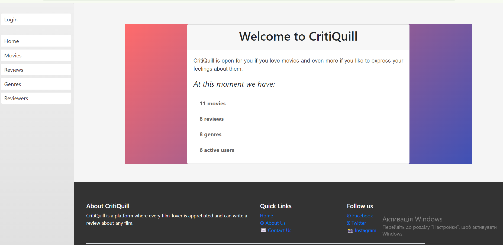
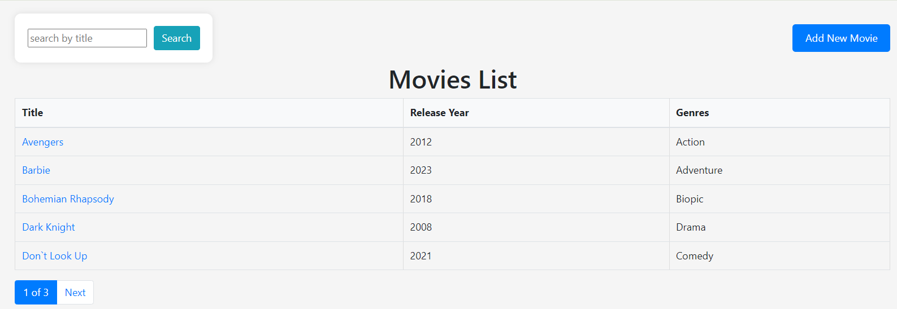
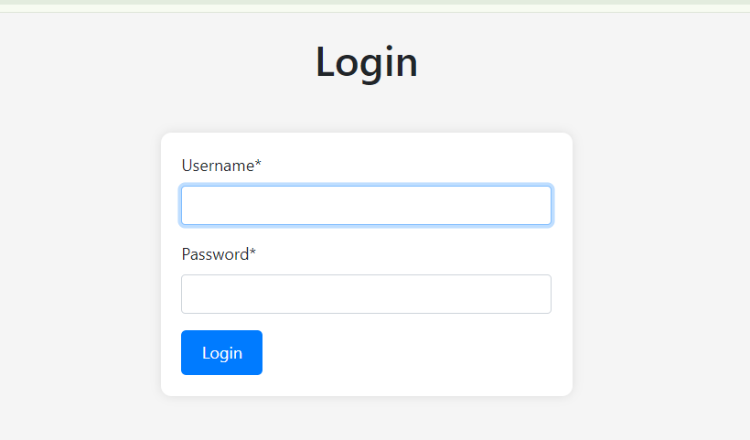

**CritiQuill: Your Destination for Honest Movie Reviews**

It's a website for movie lovers to express feelings about movies they watched.
In this project implemented few of basic Django interface possibilities.
At this moment, the website offers the following options:

- See list of available movies/genres/reviews/users (in our case movie reviewers)
- See details of individually picked movies/genres/reviews etc.
- Search specific objects of every category
- Possibility of adding movies/genres if you want to write a review about them, and they're not presented yet
- Functionalities of adding/deleting movies to favorites
- Main functionality of rating (0-5 stars gradation) and writing your thoughts about movies

Design realized in minimalistic matter, hope you enjoy this version of the website.
New features and possibilities yet to come. Stay calm and love movies.

HOW TO RUN CRITIQUILL:

1.How to install proJect

Switch to develop branch

Then push <> code button and copy link

Open terminal and write git clone and paste your copied link

Enter to code redactor program and open this folder with it

Check venv, if it doesn't activated,

write python3 -m venv venv and then venv/Scripts/activate for windows,

for MacOS python3.9 -m venv venv and source venv/bin/activate

Write python manage.py runserver and push on http://127.0.0.1:8000/

2. On server
Some of pages don`t required login:
Home page 

Movies  lists

Genres list

To check all other possibilities of app got to login page

and use this credentials:

Username: movie.admin 

Password: 1qazcde3
